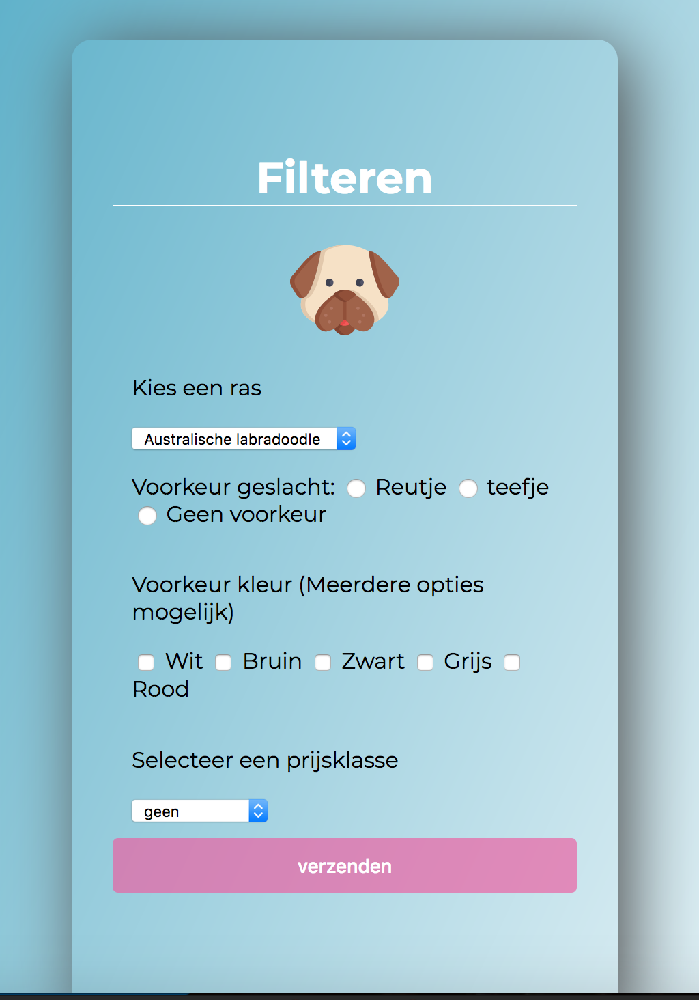

# Puppy Application
Application that help users find or add a puppy.

Live link naar demo: https://puppyduppy.herokuapp.com/

## Hoe te installeren:
### 1. Clone deze repo 
`` Git clone: https://github.com/NinaPajonk/BlokTech2021 ``

### 2.Installeer de packages
Instaleer de NPM Packages:
`` npm install ``

### 3.Start de applicatie
`` npm run dev 
``

### 4.Navigeer naar localhost
``http://localhost:3000``

## Packages
devDependencies: 
- Nodemon - Gebruikt voor het automatisch opstarten van mijn server.

dependencies:
- body-parser - Gebruikt om te verwijzen naar html-elementen
- dotenv - Gebruikt om gevoelige informatie te beschermen
- ejs - Geberuikt voor templating
- express - Gebruikt om de server in te stellen
- mongodb - Gebruikt als database
- mongoose - Gebruikt voor het maken aanmaken van een schema in mijn db
- multer  - Voor het uploaden van images

## License
MIT License

## Gebruikte bronnen:
- Traversy Media. (2017, 16 oktober). Node.js Image Uploading With Multer. YouTube. https://www.youtube.com/watch?v=9Qzmri1WaaE
- Blok Tech. (2020, 4 december). Request & Response (http) - be(). YouTube. https://www.youtube.com/watch?v=IS3HRyUXJX0
- Big thanks to [Inju Michorius](https://github.com/InjuMichorius) for answering all my questions!